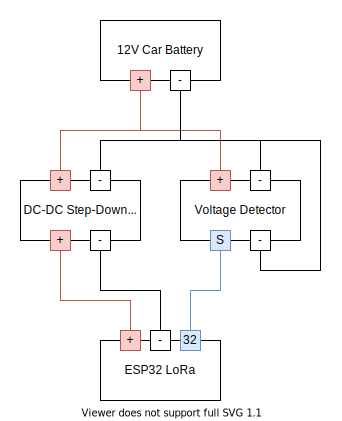

# Luzifer / lorabattery

LoRaBattery is a monitoring device for my cars battery without all the crap the existing solutions are bringing with them plus the ability to broadcast the battery voltage through [TheThingsNetwork](https://www.thethingsnetwork.org/) using [LoRaWAN](https://lora-alliance.org/about-lorawan).

## Story

Prior I was using a Chinese BM2 device which contains a Bluetooth Low-Energy chip to make the data available. Also it is constantly on to be connected to using a smartphone with the BM2-App. This approach has a few disadvantages: It consumes a lot of energy for the device being always on, the BLE connection doesn't give a damn about who is reading the data from the device (just everyone can connect to it and read the battery history and also the first connected device hogs the connection and anyone in the vicinity can block me out). Additionally BLE is a short-range communication protocol which means I'm unable to receive measurements when my car is in its parking space and there is no chance to get the data for example into an InfluxDB.

Therefore I decided I want a device under my control which can speak to my existing infrastructure and submit the data to my [Home-Assistant](https://www.home-assistant.io/) and into my InfluxDB instance. As there are a few concrete walls between my car and my nearest WiFi access-point connecting though WiFi wasn't the solution so I searched for a transmission method more suitable for long-range communication and found LoRaWAN. The reason I chose to go though TheThingsNetwork instead of a direct connection is the possibility to receive data when I'm not near my own base-station.

## Hardware

- The base of the setup is an [Heltec ESP32 LoRa Board\*](https://amzn.to/2TY0uJT)
- Power for the board is provided using a [DC-DC Step-Down module\*](https://amzn.to/3eCMAVl)
- Voltage is measured through the boards ADC from a [Voltage Detector\*](https://amzn.to/3cnCiqP)
- Connection to the battery is established though a [CTEK Comfort Connect Cable\*](https://amzn.to/2Xklnkz)
- The box containing all of the stuff is 3D printed (see `docs` folder for source files)

(\* = Amazon Ref-Link)

## Setup

